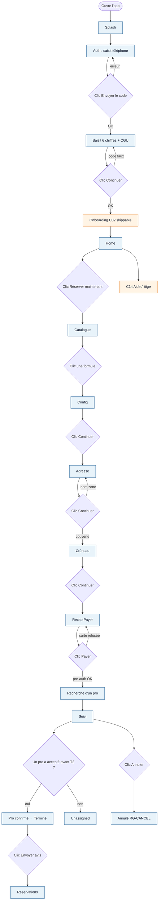
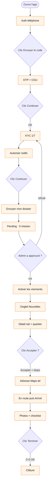
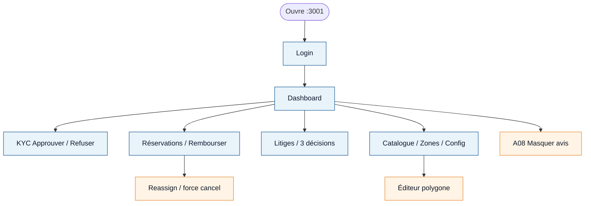

# Diagrammes d’activité — produit CarWash

> **UML** (couloirs, décisions, FAIT / A FAIRE) : [uml-activite-produit.md](uml-activite-produit.md) + [uml-activite-produit.puml](uml-activite-produit.puml).  
> **Toutes les actions** (notif, toggles, permissions) : [uml-activite-actions.md](uml-activite-actions.md).  
> Ci-dessous : **clic par clic** condensé (happy path).

Légende : **FAIT** = déjà dans une app · **A FAIRE** = pas encore. Imagination = écrans du cahier (`C00–C14` / `P00–P09` / `A01–A09`), pas le code.

---

## 1. Claire — app client

---

## 2. Marc — app pro

---

## 3. Ops — admin web

---

## 4. Tableau clic — Claire

| # | Il est sur | Il clique | Succès | Sinon | Produit |
|---|------------|-----------|--------|--------|---------|
| 1 | Splash | (auto) | Auth | — | FAIT |
| 2 | Auth | Envoyer le code | Champ OTP | Erreur / rate limit | FAIT |
| 3 | OTP + CGU | Continuer | Home | « Code incorrect. » | FAIT |
| 4 | Onboarding C02 | Continuer / Plus tard | Home | — | A FAIRE |
| 5 | Home | Réserver maintenant | Catalogue | Flag wash off | FAIT |
| 6 | Catalogue | Une formule | Config | — | FAIT |
| 7 | Config | Continuer | Adresse | — | FAIT |
| 8 | Adresse | Continuer | Créneau | Hors zone, pas de Payer | FAIT |
| 9 | Créneau | Continuer | Récap | — | FAIT |
| 10 | Récap | Payer | Confirmation | « Paiement refusé… » | FAIT |
| 11 | Suivi | (attend) | Pro confirmé | T2 : unassigned / refund | FAIT |
| 12 | Suivi | Annuler | Annulé + RG-CANCEL | Après en cours → litige | FAIT |
| 13 | Terminé | Envoyer avis | Liste | Fenêtre 72 h | FAIT |
| 14 | Profil / Aide C14 | Ouvrir litige | Litige ouvert | — | A FAIRE |

## 5. Tableau clic — Marc

| # | Il est sur | Il clique | Succès | Sinon | Produit |
|---|------------|-----------|--------|--------|---------|
| 1 | Auth P00 | Continuer | KYC 1/7 | Code incorrect | A FAIRE |
| 2 | Notifs | Autoriser / Plus tard | Suite KYC | — | A FAIRE |
| 3 | KYC P01 | Continuer / Envoyer | Pending | Champ invalide | A FAIRE |
| 4 | Pending | (attend admin) | Écran virements | Refusé → corriger | A FAIRE |
| 5 | Virements | Activer | Missions | Connect incomplet | A FAIRE |
| 6 | Nouvelles | Une carte | Détail (quartier) | Liste vide | A FAIRE |
| 7 | Détail | Accepter | Adresse complète | Déjà prise / Refuser | A FAIRE |
| 8 | Mission | En route puis Arrivé | Écran photos | — | A FAIRE |
| 9 | Photo | Caméra | Miniature + envoi | Réglages permission | A FAIRE |
| 10 | Exécution | Terminer | Clôture + net | Grisé si pas 2+2 | A FAIRE |

## 6. Tableau clic — Ops

| # | Il est sur | Il clique | Succès | Sinon | Produit |
|---|------------|-----------|--------|--------|---------|
| 1 | Login | Connexion | Dashboard | Mauvais mdp | FAIT |
| 2 | KYC | Approuver / Refuser | File à jour | Motif < 5 car. | FAIT |
| 3 | Catalogue / Zones / Config | Enregistrer | Sauvé | Hors bornes | FAIT |
| 4 | Booking | Rembourser | Annulé admin | Pas remboursable | FAIT |
| 5 | Litige | 3 décisions | Tranché | Split : notes | FAIT |
| 6 | Booking | Reassign / force cancel | — | — | A FAIRE |
| 7 | A08 | Masquer avis | Avis caché | — | A FAIRE |
| 8 | Config | Flag wash | Home sans CTA | — | A FAIRE |
