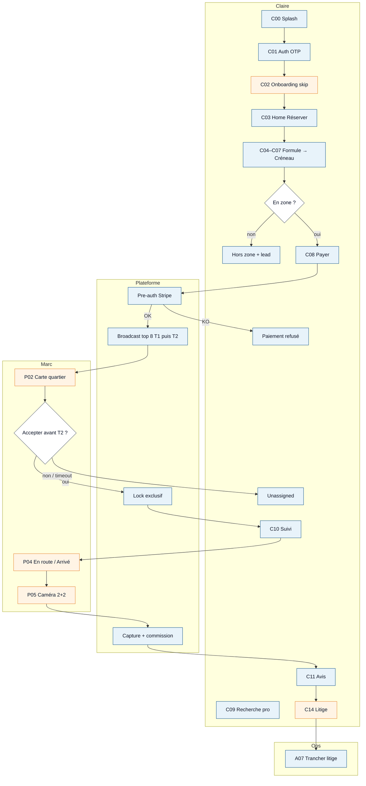
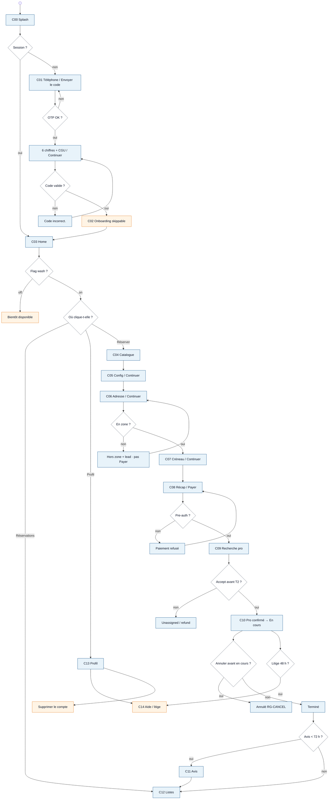
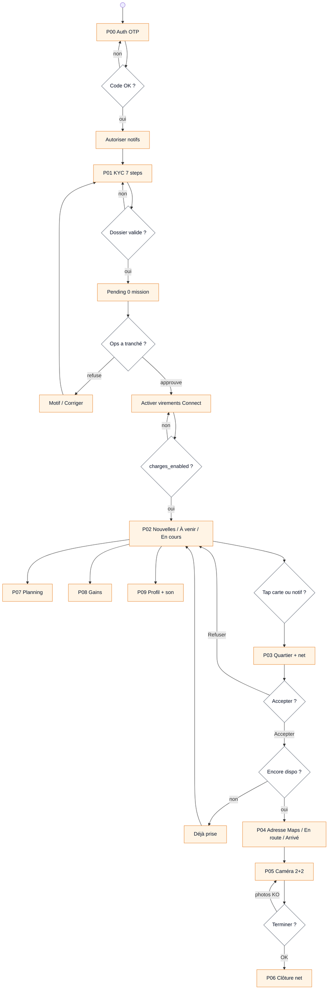
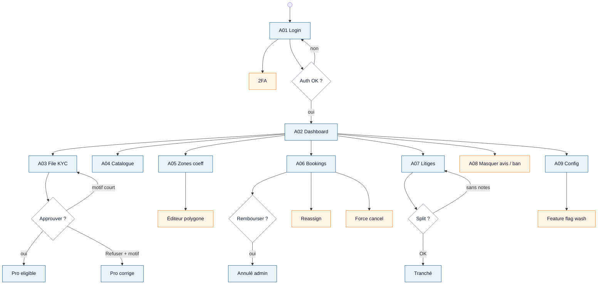
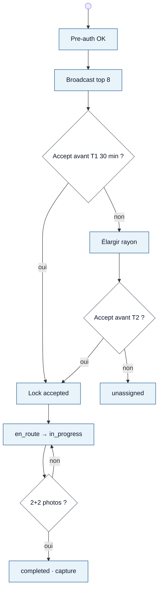
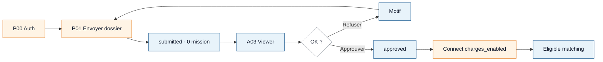
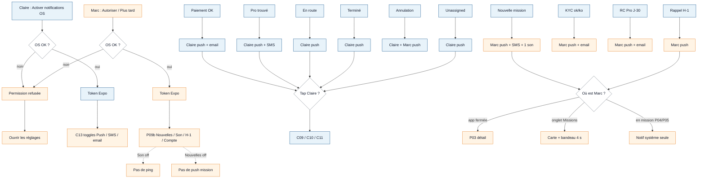

# UML — diagrammes d’activité (produit CarWash)

> **Sujet :** l’application telle que le **cahier des charges** la décrit (`C00–C14` / `P00–P09` / `A01–A09`), pas le repo d’aujourd’hui.  
> **Notation :** UML Activity — début, actions, décisions, couloirs (swimlanes), fin.  
> **Couleur :** **FAIT** (bleu) = déjà livré dans une app utilisable · **A FAIRE** (orange) = pas encore dans l’app.  
> PlantUML : [`uml-activite-produit.puml`](uml-activite-produit.puml).  
> **Catalogue de toutes les actions** (clic, toggle, notif, permission) : [`uml-activite-actions.md`](uml-activite-actions.md).

Hors MVP (phase 2+, **non dessinés**) : chat, devis, flottes, multi-pays, lavage à l’eau.

---

## Inventaire écrans — FAIT / A FAIRE

| ID | Écran (cahier) | Acteur | Produit |
|----|----------------|--------|---------|
| C00 | Splash | Claire | **FAIT** |
| C01 | Auth OTP + CGU | Claire | **FAIT** (SMS Twilio FR = A FAIRE) |
| C02 | Onboarding prénom / véhicule / adresse | Claire | **A FAIRE** |
| C03 | Home + CTA Réserver | Claire | **FAIT** |
| C04 | Catalogue formules | Claire | **FAIT** |
| C05 | Config véhicule / options / prix live | Claire | **FAIT** |
| C06 | Adresse Places + hors zone | Claire | **FAIT** |
| C07 | Créneau | Claire | **FAIT** |
| C08 | Récap / Payer pre-auth | Claire | **FAIT** |
| C09 | Confirmation Recherche pro | Claire | **FAIT** |
| C10 | Suivi timeline + annuler | Claire | **FAIT** (ouvrir litige in-app = A FAIRE) |
| C11 | Avis 72 h | Claire | **FAIT** |
| C12 | Mes réservations | Claire | **FAIT** |
| C13 | Profil / adresses | Claire | **FAIT** (suppression RGPD = A FAIRE) |
| C14 | Support / FAQ / litige 48 h | Claire | **A FAIRE** |
| P00 | Auth pro | Marc | **A FAIRE** |
| P01 | KYC wizard 7 steps | Marc | **A FAIRE** |
| P02 | Missions 3 onglets | Marc | **A FAIRE** |
| P03 | Détail quartier + Accepter | Marc | **A FAIRE** |
| P04 | Adresse / En route / Arrivé | Marc | **A FAIRE** |
| P05 | Photos 2+2 + checklist | Marc | **A FAIRE** |
| P06 | Clôture net | Marc | **A FAIRE** |
| P07 | Planning | Marc | **A FAIRE** |
| P08 | Gains | Marc | **A FAIRE** |
| P09 | Profil + notifs / son | Marc | **A FAIRE** |
| — | Stripe Connect in-app | Marc | **A FAIRE** |
| A01 | Login | Ops | **FAIT** (2FA = A FAIRE) |
| A02 | Dashboard KPIs | Ops | **FAIT** |
| A03 | File KYC | Ops | **FAIT** |
| A04 | Catalogue | Ops | **FAIT** |
| A05 | Zones + coeff | Ops | **FAIT** (éditeur polygone = A FAIRE) |
| A06 | Bookings + refund | Ops | **FAIT** (reassign / force cancel = A FAIRE) |
| A07 | Litiges | Ops | **FAIT** |
| A08 | Modérer avis | Ops | **A FAIRE** |
| A09 | Config plateforme | Ops | **FAIT** (flag `wash` UI = A FAIRE) |
| — | Matching T1/T2 + capture | Plateforme | **FAIT** (API ; Marc n’a pas d’UI) |

---

## 0. Golden path — 4 couloirs (UML)

Le lavage complet : Claire réserve → plateforme matche → Marc exécute → Ops tranche un litige s’il y en a.

---

## 1. Claire — activité UML

---

## 2. Marc — activité UML (graphe entier **A FAIRE**)

*(Socle Expo existe : ce n’est pas un parcours. Tout Marc = A FAIRE.)*

---

## 3. Ops — activité UML

---

## 4. Plateforme — matching (invisible, **FAIT** API)

---

## 5. KYC — Marc × Ops

---

## 6. Notifications — activité UML (RG-NOTIF)

Tap / permission / toggles. L’API envoie déjà (FAIT). L’app Marc + toggles fins = A FAIRE.

---

## 7. Toggles / activer–désactiver — activité UML

```mermaid
flowchart TD
  classDef fait fill:#E8F3FA,stroke:#0B4F8A,color:#0F172A
  classDef todo fill:#FFF4E5,stroke:#E67E22,color:#0F172A
  classDef gate fill:#FFFFFF,stroke:#5B6472,color:#0F172A

  c05[C05 Config]
  c05 --> veh[Radio véhicule]
  c05 --> dirt[Radio saleté]
  c05 --> opt{Toggle option}
  opt -->|on| plus[Prix + duration_delta]
  opt -->|off| moins[Retire du snapshot]
  c05 --> com[Commentaire 300]
  c05 --> ph[Photos préalable 0–5]
  c08[C08] --> cgv{CGV cochées ?}
  cgv -->|non| noPay[Payer grisé]
  cgv -->|oui| pay[Payer]

  p01[P01 KYC]
  p01 --> meth{Sans eau / Vapeur}
  meth -->|0| kycBlock[Continuer grisé]
  meth -->|≥1| kycOk[Continuer KYC]
  p01 --> cap[Toggles formules capabilities]
  p05[P05] --> chk{Case checklist}
  chk --> photos{2+2 photos}
  photos -->|non| termOff[Terminer grisé]
  photos -->|oui| termOn[Terminer]
  p07[P07] --> pause[Pause ponctuelle on/off]
  p07 --> block[Bloquer créneau]
  p09[P09] --> formules[Formules actives on/off]
  p09 --> notif[4 toggles notifs]

  a04[A04] --> cat{Catégorie / offre / option}
  cat -->|Désactiver| hide[Invisible au book]
  cat -->|Activer| show[Visible C04]
  a05[A05] --> zon{Zone active ?}
  zon -->|off| noBook[Hors zone]
  a09[A09] --> flag{Flag wash}
  flag -->|off| soon[Home sans CTA]

  c05:::fait
  veh:::fait
  dirt:::fait
  opt:::gate
  plus:::fait
  moins:::fait
  com:::todo
  ph:::todo
  c08:::fait
  cgv:::gate
  noPay:::todo
  pay:::fait
  p01:::todo
  meth:::gate
  kycBlock:::todo
  kycOk:::todo
  cap:::todo
  p05:::todo
  chk:::gate
  photos:::gate
  termOff:::todo
  termOn:::todo
  p07:::todo
  pause:::todo
  block:::todo
  p09:::todo
  formules:::todo
  notif:::todo
  a04:::fait
  cat:::gate
  hide:::fait
  show:::fait
  a05:::fait
  zon:::gate
  noBook:::fait
  a09:::fait
  flag:::gate
  soon:::todo
```

Catalogue de **toutes** les actions (clic, toggle, notif, permission) : [uml-activite-actions.md](uml-activite-actions.md). Clics condensés : [diagramme-activite.md](diagramme-activite.md). Canvas : à côté du chat.
